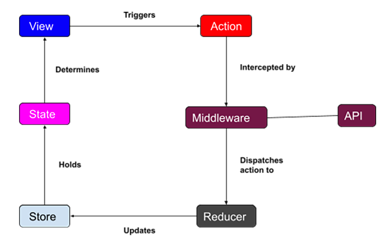

# flutter_redux implementation notes 

### Env.
- Flutter SDK 2.5.1
- Dart 2.1.4
- redux ^5.0.0
- flutter_redux ^0.8.2
- flutter_thunk ^0.4.0

### Redux synchronous architecture


### Redux asynchronous architecture


### Store
- An redux provided class which to store state objects
- Using generic to indicate stored state. ex: `Store<MyState> store = Store<MyState>()`  
- Use `state` attribute to access state object
- `dispatch` method take two kinds of action object as argument to trigger the state updating flow
  1. A simple object will trigger **synchronous** flow
  2. A **function using Store as its single argument** will trigger **asynchronous** flow
- 3 arguments for constructor, 
  - `required` reducer: An function which will be executed by dispatch method.  
  - `required` initialState: A state object to indicate the state in time 0
  - `optional` middleware: Provide `[middleware]` constantly.  It's used for async flow. (flutter_thunk package is needed)
```
Store<MyState> store = Store<MyState>(
    reducer,
    initialState: MyState.initial(),
    middleware: [middleware]
)
```

### State
- A custom class for saving needed state values

### Action
- **Type1:** **Any type of object** which include information to state update.
- **Type2:** **Function** which receive Store instance as the only arguments.
- Used as argument of dispatch method. `store.dispatch(MyAction)`  
- For type1, action object will be provided to **reducer**.  
- For type2, this function will be executed first, after function's callback being received (ex. API's response), dispatch should be triggered and provide another action to reducer

### Reducer
- The logic handler
- A Function takes two arguments: **State** and **Action**, then return a **new State**
- Needs to be a **pure function**
```
MyState myReducer(MyState currentState, dynamic action) {
    // Business logic
    // ...
    return MyState();
}
```

### StoreProvider
- Set store to the widget tree, make store instance accessible by child widgets
- Provide: 
```
Widget build(BuildContext context) {
    return StoreProvider<MyState>(
        store: Store<MyState>(
            reducer, 
            initialState: MyState(),
            middleware: [middleware],
        )
        child: MaterialApp(
            ...
            ...
        );
    );
}
```
- Access: 
```
Widget build(BuildContext context) {
    final store = StoreProvider.of<MyState>(context)
    return Container(
        ...
    );
}
```

### StoreConnector
- Used to build widget, every time state updated, widget will rebuild.  
- Two arguments required
  - `converter`: a function, take store as argument and return a dynamic type (consider as a viewModel), this reture value will provide to builder for create widgets
  - `builder`: a function, take context and a converter's return value as arguments  
```
StoreConnector<MyState, MyViewModel>(
    converter: (Store<MyState> store) => MyViewModel(),
    builder: (BuildContext context, MyViewModel viewModel) {
        return Container(
            ...
        );
    }
);
```

